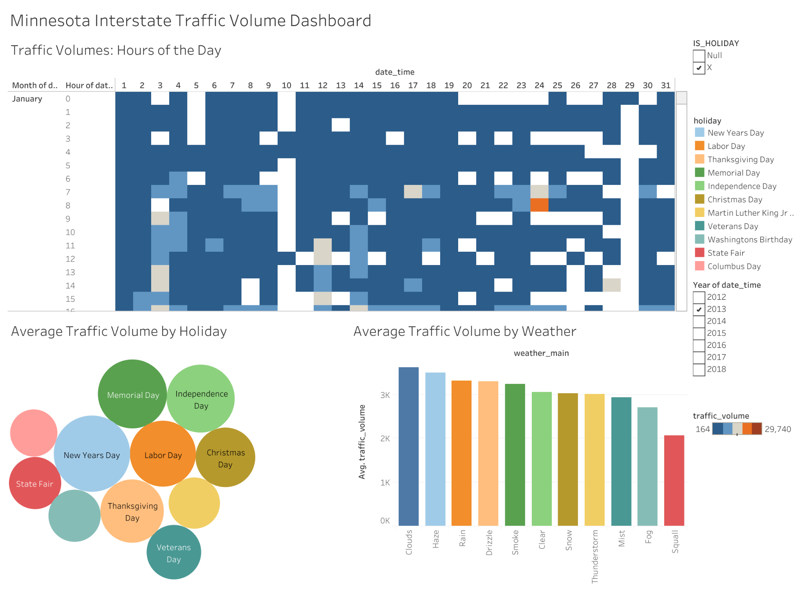

# Minnesota Interstate Traffic Volume Analysis

## Project overview

This project analyzes hourly traffic volume on westbound Interstate 94 between Minneapolis and St. Paul, Minnesota. The goal is to help transportation stakeholders understand when traffic demand is highest and how holidays, weather, and time patterns affect roadway use.

## Business problem

Transportation teams need a clear view of when interstate demand rises or falls so they can plan operations, staffing, incident readiness, congestion responses, and traveler communication.

## Dashboard



> The Tableau Public URL will be added after the existing visualization link is recovered.

## Business questions

- When does traffic volume change most across the day?
- Which holidays show the greatest average demand?
- How does traffic vary by weather condition?

## Methods

1. **Prepare:** Reviewed the date/time, holiday, weather, and traffic-volume fields and organized time dimensions for comparison.
2. **Analyze:** Compared average traffic volume by hour, holiday, and primary weather condition.
3. **Visualize:** Built a calendar-style heatmap, packed-bubble chart, and ranked bar chart in Tableau.
4. Added interactive filters so users can isolate a year and holiday status for focused comparisons.

## Key findings

1. **New Year's Day appears as the highest-volume holiday.**
2. **Clouds and haze lead the weather categories, while squall has the lowest average traffic volume.**
3. **Traffic varies substantially by hour and date, supporting time-specific rather than one-size-fits-all planning.**

## Recommendations

- **Prioritize peak periods:** Align staffing, traffic messaging, and incident readiness with the busiest hours and dates.
- **Prepare for holiday demand:** Use New Year's Day and other high-volume holidays as planning benchmarks.
- **Add context in future analysis:** Incorporate roadway direction, location, crashes, and travel speed to explain where congestion has the greatest impact.

## Tools

- Tableau
- Microsoft Excel
- Data cleaning
- Exploratory data analysis
- Data visualization

## Data source

[Metro Interstate Traffic Volume dataset — UCI Machine Learning Repository](https://archive.ics.uci.edu/dataset/492/metro+interstate+traffic+volume)

The dataset contains hourly traffic, weather, and holiday observations collected at an I-94 traffic station in Minnesota.

## Presentation

[Download the Minnesota Interstate Traffic Volume presentation](presentation/minnesota_traffic_volume_presentation.pptx)

## Repository structure

```text
.
├── README.md
├── images/
│   └── minnesota_traffic_volume_dashboard.png
└── presentation/
    └── minnesota_traffic_volume_presentation.pptx
```
